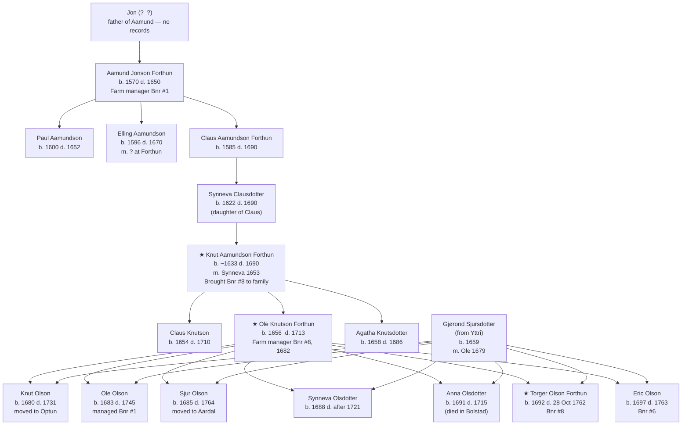
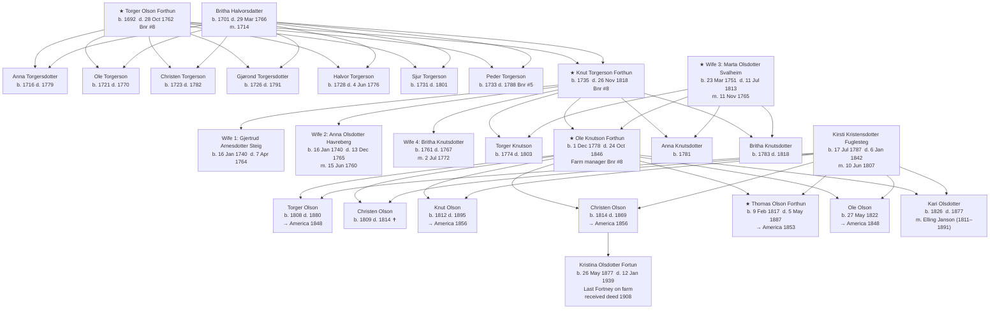
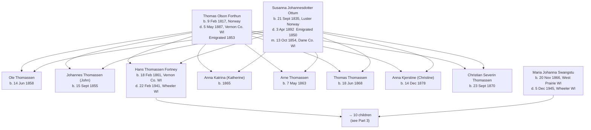
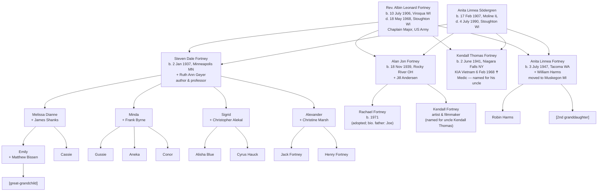
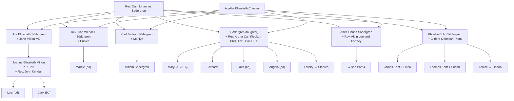

# Fortney Family Tree

## Norwegian Origins to American Descendants

*Compiled from the Forthun Family Reunion genealogical research, the Centennial Reunion 2007 presentation, the Södergren Cousins records (2017), and Alan Jon Fortney's family timeline.*

---

## Part 1: Norwegian Origins — The Forthun Farm

The family name derives from **Forthun** (also spelled Fortun), a farm and village in **Luster parish, Sogn, Norway**. The Norwegian farm numbering system (*bruks nummer*, Bnr) tracks which parcel of land a family held. The Fortney line runs through **Bnr #8**.

The original **Fortun Stave Church** stood in the village until 1883, when it was sold to Bergen merchants and relocated — it became the famous **Fantofte Stavkirke** in Bergen. (It was burned by arsonists in 1992 and rebuilt.) The last family member to live on the farm itself was **Kristina Olsdotter Fortun** (b. 26 May 1877, d. 12 Jan 1939), who received the deed from her emigrating brother in 1908 and managed it until around 1925. Her grave was found in the kirkegård across from the village church. The farm (Bnr 8) passed through several hands and is today held by the Otterhjell family; Alan and Jill visited and confirmed the genealogy with Torill Otterhjell in 2005.

The main line runs through **Bnr #8**, which came into the family when **Synneva Clausdotter** married **Knut Aamundson** in 1653. The diagrams below show the full documented lineage with all known siblings at each generation. The main Bnr #8 line is the path that leads to the American Fortneys.

### Diagram 1A — Generations 7 through 5: Aamund to Ole's Children (c. 1570–1715)

*★ marks the Bnr #8 main line. Farm Bnr #6 was divided off for Eric's line in 1715.*

### Diagram 1B — Generations 4 through 2: Torger to the Emigrants (c. 1692–1856)

*★ marks the Bnr #8 main line. Five of Ole's seven children emigrated to America between 1848–1856.*

---

## Part 2: The Emigrant — Thomas Olson to Hans Thomassen

**Thomas Olson Forthun** (b. 9 Feb 1817, Forthun; d. 5 May 1887, Vernon County, WI) emigrated in 1853, settling first in Franklin County, then Vernon County, Wisconsin. He married **Susanna Johannesdotter Ottum** (b. 21 Sept 1835, Luster, Norway; d. 3 Apr 1892), who had emigrated in 1850, on 13 October 1854 in Dane County, WI. Together they had eight children, the sixth of whom — **Hans Thomassen Fortney** — became the patriarch of the American Fortney family.

Hans and his wife **Maria Johanna Swangstu** (b. 20 Nov 1866, West Prairie, WI; d. 5 Dec 1945, Wheeler, WI) married on 6 April 1887 and moved their family to **Wheeler, Wisconsin** in 1907, which became the family's home base. They had ten children; the farm is pictured in the Centennial Reunion presentation, photographed in 1907.

---

## Part 3: Hans & Maria's Ten Children

Hans and Maria's ten children were born in Viroqua and Vernon County, Wisconsin between 1889 and 1919. Two died young or childless; the remaining eight produced 26 grandchildren, 66 great-grandchildren, and over 100 great-great-grandchildren by 2007.

```mermaid
%%{init: {"flowchart": {"rankSpacing": 55, "nodeSpacing": 35}}}%%
graph TD
    HM["Hans Thomassen Fortney\n+ Maria Johanna Swangstu\nWheeler, Wisconsin"]

    HM --> SUSANAM["I. Susana Mathilda\nb. 15 Aug 1889\nd. Jan 1909 (smallpox) ✝"]
    HM --> ALBERT["II. Albert Christian Fortney\nb. 18 Feb 1891  d. 6 May 1937\n+ Viola Vennes"]
    HM --> NETTIE["III. Tonetta Marthia (Nettie)\nb. 6 Apr 1893  d. 16 Jan 1988\n+ Rev. Frederick Dahl"]
    HM --> SELMA["IV. Selma Kathrina\nb. 27 Mar 1895  d. 9 Oct 1960\n+ Nelmer Bergum"]
    HM --> CLARENCE["V. Clarence Edward\nb. 1 May 1897  d. 26 Nov 1968\n+ Anna Skreen"]
    HM --> OLIVER["VI. Oliver John\nb. 12 Sept 1899  d. 2 Oct 1950\n+ Lilian Gregerson"]
    HM --> HENRY["VII. Henry Martin\nb. 1 Nov 1901  d. 2 Jun 1975\n+ Caroline Margaret Smith"]
    HM --> THOMAS_K["VIII. Thomas Kendahl\nb. 4 May 1904  d. 14 Nov 1944\n+ Elsie Carson  No children"]
    HM --> ALBIN["IX. Albin Leonard\nb. 10 Jul 1906  d. 18 May 1968\n+ Anita Linnea Södergren"]
    HM --> MYRTIE["X. Myrtie Susanna\nb. 25 Feb 1919  d. 11 May 1986\n+ Andrew Ole Larson"]

    ALBERT --> MARION["Marion Lucile\nb. 1 Apr 1919\nd. 1929 (meningitis) ✝"]
    ALBERT --> HUBERT["Hubert Vennes Fortney\nb. 26 Apr 1922\nd. 4 Jan 2005"]
    ALBERT --> VIRGIL["Virgil A. Fortney\nb. 12 Sept 1925\nd. 1 Jan 1982"]

    NETTIE --> ADRIAND["Adrian Hilman Dahl\nb. 6 Dec 1919  d. 2 Dec 2002"]
    NETTIE --> MONRADD["Monrad 'Doc' Kenneth Dahl\nb. 28 Aug 1921  d. 9 Jan 1993"]
    NETTIE --> FREDERICD["Frederick Thomas Dahl\nb. 10 Sept 1923  d. 26 Sept 1983"]
    NETTIE --> SYLVIAD["Sylvia Dahl\nb. 25 Feb 1926"]
    NETTIE --> GILROYD["Gilroy Vernon Dahl\nb. 12 Jul 1931  d. 1982"]

    SELMA --> STANLEY["Stanley Nelmer Bergum\nb. 19 Nov 1930"]
    SELMA --> KONVAL["Konval Harlan Bergum\nb. 14 Apr 1933"]

    CLARENCE --> HILLMAN["Hillman Arnold Fortney\nb. 27 Jun 1919"]
    CLARENCE --> AGNES["Agnes Marie Fortney\nb. 13 Nov 1922"]
    CLARENCE --> RALPH["Ralph Clarence Fortney\nb. 19 Oct 1930"]

    OLIVER --> MICHAEL["Michael Dee Fortney\nb. 12 Mar 1939\nd. 17 Aug 1997"]

    HENRY --> CHRISTINE["Christine Ellen Fortney\nb. 2 Jan 1942"]
    HENRY --> KARN["Karn Louise Fortney\nb. 17 Feb 1944"]
    HENRY --> THOMASF["Thomas Frederick Fortney\nb. 3 Aug 1945\nd. 29 Sept 1966 ✝"]

    ALBIN --> ALBIN_FAM["→ see Part 4"]

    MYRTIE --> THOMAS_L["Thomas Andrew Larson\nb. 9 Sept 1938"]
    MYRTIE --> MARY_L["Mary Ann Larson\nb. 17 Feb 1941\n→ Langford"]
    MYRTIE --> LINDA_L["Linda Rae Larson\nb. 16 Aug 1942\n→ Olson"]
    MYRTIE --> ORLAND_L["Orland John Larson\nb. 14 Feb 1944"]
    MYRTIE --> LAUREL_L["Laurel Jean Larson\nb. 25 Feb 1947\n→ Madsen"]
```

**Note on Thomas Kendahl Fortney [VIII]:** This is Albin's older brother — the same "brother Tom" Albin went to Detroit in 1937-38 expecting to work with as a social worker. Thomas Kendahl died in Detroit in 1944, just before the war ended. He and Elsie had no children.

**Note on the Larson cousins:** The "Larson cousins" that appear throughout Alan's journals and correspondence — Tom, Mary Ann, Linda, Orland, and Laurel — are the children of **Myrtie Fortney** (Albin's youngest sister) and **Andrew Ole Larson** of Menomonie, WI. They are Alan's first cousins. Cousin Linda's husband Rich had a summer house on Tainter Lake — the same lake the Fortneys sheltered at in 1944–45. Cousin Laurel's husband Ollie encountered Kendall Thomas in Vietnam.

**Note on Virgil Fortney:** Virgil is Albin's **nephew** (son of brother Albert), b. 1925, d. 1982. His children George, Robert, and Phillip are Alan's first cousins once removed.

---

## Part 4: Albin & Anita's Branch

For the full narrative, see [Fortney Family Timeline.md](Fortney Family Timeline.md).

---

## Part 5: The Södergren Line (Anita's Side)

**Rev. Carl Johannes Södergren** and **Agatha Elizabeth Chester** had six known children, of whom Anita Linnea was the fifth. The family was deeply rooted in Lutheran ministry.

---

## Research Gaps

| Gap | Notes |
| --- | --- |
| Aamund Jonson's father Jon | No records exist before Aamund (b. 1570) |
| Knut Aamundson parentage | Dates suggest Aamund Jonson may not be his direct father; earlier genealogies listed him as such but ages don't fit |
| Thomas Olson → Hans: siblings' descendants | Ole, Johannes, Anna, Arne, Thomas, Christine Thomassen lines not traced |
| Swangstu family (Maria's line) | No ancestors documented beyond Maria's birth in West Prairie, WI |
| Albin's siblings' Generation III descendants | Hubert Fortney, the Bergums, the Dahls, Ralph/Hillman/Agnes Fortney, Michael Fortney — children not yet documented |
| Södergren daughter who married Piepkorn | Her given name not recorded in available documents |
| Anita Fortney's 2nd granddaughter | Name not found in available documents |
| Rachael Fortney's biological father Joe | Surname unknown |
| Virgil Fortney's children | George (+ Leslie), Robert (+ Mark), Phillip — next generation not documented |
| Several `(bd)` entries | Living descendants — details withheld for privacy |
